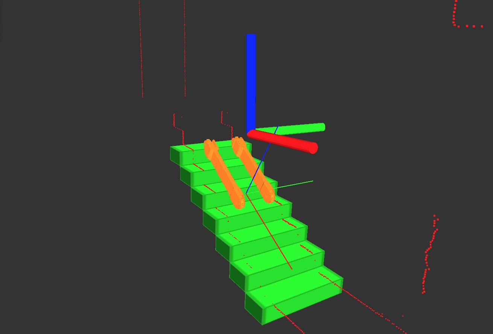

# Scalaser

## Overview

The scalaser package was created as a part of the bachelor thesis of Miro Voellmy. It was specifically developed for stair climbing wheelchair Scalevo.

The PACKAGE NAME package has been tested under [ROS] Indigo and Ubuntu 14.04. This is research code, expect that it changes often and any fitness for a particular purpose is disclaimed.

The source code is released under a [BSD 3-Clause license](ros_package_template/LICENSE).

**Author: Miro Voellmy  
Contact: Miro Voellmy, mvoellmy@ethz.ch  
Affiliation: Autonomous Systems Lab, ETH Zurich**

### Publications

If you use this work in an academic context, please cite the following publication(s):
	
* M. Voellmy, P. Fankhauser, M. Hutter, and R. Siegwart: **Stairrecognition on a stair climbing wheelchair using LIDAR Sensors**. IEEE/RSJ International Conference of Placeholders (IROS), 2015. ([PDF](https://www.youtube.com/watch?v=dQw4w9WgXcQ))

## Installation

### Dependencies

- [Robot Operating System (ROS)](http://wiki.ros.org) (middleware for robotics),
- [Eigen](http://eigen.tuxfamily.org) (linear algebra library),
- [Matlab](http://ch.mathworks.com/products/matlab/) (matlab),
- [c_matlabcppinterface](https://bitbucket.org/adrlab/c_matlabcppinterface/wiki/Home) (matlab C++ interface),
- [scalevo_msgs](http://www.github.com/scalevo/scalevo_msgs) (messages package of scalevo),
### Building

In order to install, clone the latest version from this repository into your catkin workspace and compile the package using

	cd catkin_workspace/src
	git clone https://github.com/scalevo/scalaser.git
	cd ../
	catkin_make

### Tests

Package tests have not been implemented yet. You can run this command however if you want to watch Starwars Episode IV: 

	telnet towel.blinkenlights.nl

## Usage

First start the two SICK sensors on board of the Scalevo wheelchair using

	roslaunch scalaser pointcloud_2.launch

then start the stair recognition node with

	roslaunch scalaser angle.launch

Check the launch files if you want to change a modifiable parameters.

## Nodes

### Angle

Main node to determine the angle of the stair on stairs.

#### Subscribed Topics

* **`cloud_1`** ([sensor_msgs/PointCloud])

	Pointcloud of the right laser sensor.
	
* **`cloud_2`** ([sensor_msgs/PointCloud])

	Pointcloud of the left laser sensor.

#### Published Topics

* **`beta`** ([std_msgs/Float64])

	Angle of the wheelchair on the stairs. 

* **`stair_parameters`** ([std_msgs/Float64MultiArray])
	
	Determined parameters of the stair and the wheelchairs position on the stair.

* **`stair_model`** ([visualization_msgs/Marker])

	The marker for the stair visualization in [rviz].

* **`chair_model`** ([visualization_msgs/Marker])

	The marker for the chair visualization in [rviz].

#### Services

* **`trigger`** ([std_srvs/Empty])

	Trigger the computation process. For example, you can trigger the computation from the console with

		rosservice call /NODE_A_NAME/trigger

#### Parameters

* **`scalaser/fov_s`** (int, default: 200)

	The start of the field of view.
		
* **`scalaser/fov_s`** (int, default: 150)

	The size of the field of view.

* **`scalaser/kp`** (double, default: 0.008)
	
	P value used to determine the motor velocity.

### StairModel

Publishes a model of the stairs for visualization in rviz.

### ChairModel

Publishes a model of the wheelchair positioned on the stairs for visualization in rviz.

## Bugs & Feature Requests

Please report bugs and request features using the issue feature of this package.

[ROS]: http://www.ros.org
[rviz]: http://wiki.ros.org/rviz
[Eigen]: http://eigen.tuxfamily.org
[Gazebo]: http://gazebosim.org/
[rviz]: http://wiki.ros.org/rviz
[starleth_msgs/SeActuatorCommands]: https://bitbucket.org/ethz-asl-lr/c_starleth_ros_common/raw/master/starleth_msgs/msg/SeActuatorCommands.msg
[grid_map_msg/GridMap]: https://github.com/ethz-asl/grid_map/blob/master/grid_map_msg/msg/GridMap.msg
[sensor_msgs/PointCloud2]: http://docs.ros.org/api/sensor_msgs/html/msg/PointCloud2.html
[visualization_msgs/Marker]: http://docs.ros.org/api/visualization_msgs/html/msg/Marker.html
[nav_msgs/OccupancyGrid]: http://docs.ros.org/api/nav_msgs/html/msg/OccupancyGrid.html
[std_srvs/Empty]: http://docs.ros.org/api/std_srvs/html/srv/Empty.html